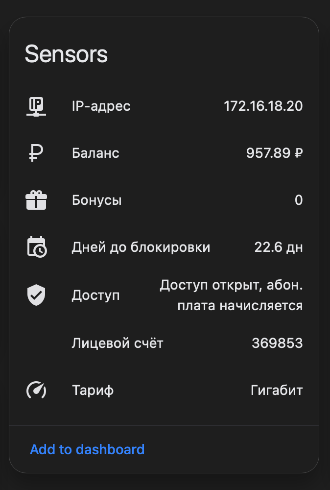

<div align="center">
  <h1>
    
    G-Service · Home Assistant
  </h1>
  <p>
    <b>"Игра-Сервис" провайдерінің ресми емес Home Assistant интеграциясы</b><br>
    <i>Авторизациясыз жеке шот деректерін алу — провайдер желісіндегі IP арқылы</i>
  </p>
  <p>
    🌐 <a href="README.md">Русский</a> · <a href="README.en.md">English</a> · <a href="README.zh.md">简体中文</a> · <a href="README.tr.md">Türkçe</a> · <b>Қазақша</b> · <a href="README.uz.md">Oʻzbekcha</a>
  </p>
  <p>
    <a href="https://github.com/mordvn/ha_g-service/releases"></a>
    <a href="https://github.com/mordvn/ha_g-service/releases"></a>
  </p>
  <p>
    
  </p>
</div>

---

## 🌐 Мазмұны

- [✨ Мүмкіндіктер](#-мүмкіндіктер)
- [📦 Орнату](#-орнату)
- [🔧 Жаңарту аралығын баптау](#-жаңарту-аралығын-баптау)
- [📊 Сенсорлар](#-сенсорлар)
- [🧠 «Блоктауға қалған күндер» смарт-сенсоры](#-блоктауға-қалған-күндер-смарт-сенсоры)
- [💡 Lovelace мысалдары](#-lovelace-мысалдары)
- [⚙️ Қалай жұмыс істейді](#️-қалай-жұмыс-істейді)
- [📋 Талаптар](#-талаптар)
- [🐛 Мәселе туралы хабарлау](#-мәселе-туралы-хабарлау)

---

## ✨ Мүмкіндіктер

- **7 сенсор** — баланс, жеке шот нөмірі, тариф, қолжетімділік күйі, IP-мекенжай, бонустар, блоктауға қалған күндер
- **Авторизация қажет емес** — деректер провайдердің жалпыға қолжетімді HTML бетінен алынады, G-Service желісінде IP арқылы қолжетімді
- **Config Flow** — Home Assistant интерфейсі арқылы баптау, YAML қажет емес
- **Бапталатын жаңарту аралығы** — 1 минуттан 24 сағатқа дейін (әдепкі: 2 сағат)
- **Қосымша тәуелділіктер жоқ** — тек Home Assistant-та бар `aiohttp` пайдаланылады

---

## 📦 Орнату

### Config Flow арқылы (ұсынылады)

```bash
# 1. Қаптаманы custom_components ішіне көшіріңіз
cp -r custom_components/g_service /config/custom_components/

# 2. Home Assistant-ты қайта іске қосыңыз
#    Settings → System → Restart

# 3. Интеграцияны қосыңыз
#    Settings → Devices & Services → Add Integration
#    «G-Service (Игра-Сервис)» табыңыз → Қосу
```

Болды! Сенсорлар автоматты түрде пайда болады. Кілттер, токендер немесе логиндер қажет емес.

### HACS арқылы (қолмен орнату)

<details>
<summary>Нұсқаулық</summary>

1. HACS → **Integrations** бөлімін ашыңыз
2. `…` → **Custom repositories** түймесін басыңыз
3. `https://github.com/mordvn/ha_g-service` мекенжайын **Integration** түрімен қосыңыз
4. **Install** түймесін басыңыз
5. HA-ны қайта іске қосып, **Settings → Devices & Services** арқылы қосыңыз

</details>

---

## 🔧 Жаңарту аралығын баптау

Орнатқаннан кейін интеграция картасындағы **Configure** (⚙️) түймесін басыңыз:

| Параметр | Мәні |
|----------|------|
| **Әдепкі** | 7200 с (2 сағат) |
| **Минимум** | 60 с (1 минут) |
| **Максимум** | 86400 с (24 сағат) |

---

## 📊 Сенсорлар

| Entity ID | Сипаттамасы | Белгіше | Өлшем бірлігі |
|-----------|-------------|---------|---------------|
| `sensor.g_service_balance` | **Баланс** | `mdi:currency-rub` | ₽ |
| `sensor.g_service_days_remaining` | **Блоктауға қалған күндер** | `mdi:calendar-clock` | күн |
| `sensor.g_service_account` | **Жеке шот нөмірі** | `mdi:account-card-details` | — |
| `sensor.g_service_plan` | **Тариф** (мысалы, Гигабит) | `mdi:speedometer` | — |
| `sensor.g_service_access` | **Қолжетімділік күйі** | `mdi:shield-check` | — |
| `sensor.g_service_ip` | **IP-мекенжай** | `mdi:ip-network` | — |
| `sensor.g_service_bonuses` | **Бонустар** | `mdi:gift` | — |

---

## 🧠 «Блоктауға қалған күндер» смарт-сенсоры

Бұл сенсор провайдер сайтындағы тариф бағасы негізінде **болжамды есептейді**.

### Қалай жұмыс істейді

1. Жеке шот бетінен тариф атауын алады (мысалы, «Гигабит»)
2. `/internet/` бетінде оның бағасын табады (мысалы, 1270 ₽/ай)
3. Есептейді: `блоктауға_қалған_күн = баланс / (айлық_тариф_бағасы / 30)`

```
Баланс: 957 ₽
Тариф «Гигабит»: 1270 ₽/ай → 42.3 ₽/күн
→ 957 / 42.3 ≈ 22.6 күн
```

### Тариф бағасы табылмаса

Егер сіздің тарифіңіз ескірген болса немесе жалпы тізімде жоқ болса, сенсор автоматты түрде резервтік режимге ауысады: баланс өзгеру тарихын талдап, орташа тәуліктік шығын жылдамдығын есептейді.

### Мүмкін мәндер

| Мән | Мағынасы |
|-----|----------|
| `22.6` | Шамамен 22.6 күннен кейін блоктау |
| `0` | Қолжетімділік бұрыннан блокталған |
| `None` | Деректер жеткіліксіз |

### Ерекшеліктер

- Шот толықтырылғанда, есептеуді бұзбау үшін баланс тарихы тазартылады
- Орнатқаннан кейін бірден жұмыс істейді — тарих жиналуын күтудің қажеті жоқ (тариф табылса)

---

## 💡 Lovelace мысалдары

### Қарапайым панель

```yaml
type: entities
title: G-Service (Игра-Сервис)
entities:
  - entity: sensor.g_service_balance
  - entity: sensor.g_service_days_remaining
  - entity: sensor.g_service_access
  - entity: sensor.g_service_account
  - entity: sensor.g_service_plan
  - entity: sensor.g_service_ip
  - entity: sensor.g_service_bonuses
```

### Баланс көрсеткіші

```yaml
type: gauge
entity: sensor.g_service_balance
unit: ₽
min: 0
max: 500
severity:
  green: 200
  yellow: 100
  red: 0
```

### Шартты карта

```yaml
type: conditional
conditions:
  - entity: sensor.g_service_access
    state_not: 'открыт, абон.'
card:
  type: markdown
  content: >
    ⚠️ **Назар аударыңыз!** Интернетке қолжетімділік шектелген!
    Баланс: {{ states('sensor.g_service_balance') }} ₽
    G-Service жеке кабинетінде шотыңызды толтырыңыз.
```

---

## ⚙️ Қалай жұмыс істейді

Интеграция провайдер сайтының екі бетіне GET сұрауларын жібереді және HTML-ді тұрақты өрнектер көмегімен талдайды. Авторизация қажет емес — провайдер абонент деректерін IP-мекенжай бойынша автоматты түрде қайтарады.

**Деректер көздері:**

| URL | Не талданады |
|-----|-------------|
| `https://www.g-service.ru/` | Тақырып (ЖШ, баланс) және модальды терезе (тариф, қолжетімділік, IP, бонустар) |
| `https://www.g-service.ru/internet/` | Блоктауға қалған күндерді есептеу үшін тариф бағалары |

HTML талдау — күміс оқ емес. Егер провайдер бет құрылымын өзгертсе, интеграция жұмысын тоқтатуы мүмкін.

### Архитектура

```
┌─────────────────────┐     GET https://www.g-service.ru/
│  Home Assistant      │ ──────────────────────────────────►  G-Service
│  DataUpdateCoordinator│ ◄──────────────────────────────────  Сервер
│  (әр 2 сағат сайын)   │     HTML деректер беті
├─────────────────────┤     GET https://www.g-service.ru/internet/
│  _parse_html()       │ ◄──────────────────────────────────  Тарифтер
│  ↓                   │
│  balance, account,   │
│  access, plan,       │
│  ip, bonuses         │
├─────────────────────┤
│  _parse_tariff_prices│     Тариф бағаларын талдау
│  ↓                   │     Тариф атауы бойынша сәйкестендіру
│  _compute_days_left()│     баланс / (айлық_баға / 30)
│  ↓                   │     НЕМЕСЕ баланс тарихы (резерв)
│  days_remaining      │
└─────────────────────┘

```

---

## 📋 Талаптар

- **Home Assistant** 2023.8.0 немесе одан жаңа
- **G-Service желісіне қосылған** — Home Assistant провайдер желісінде болуы керек (WiFi немесе ethernet), сонда g-service.ru сіздің IP-іңізді абонент ретінде көреді
- Қосымша кітапханалар қажет емес — HA барлық қажетті компоненттерді қамтиды

---

## 🐛 Мәселе туралы хабарлау

Қате таптыңыз ба? Провайдер сайтты жаңартып, интеграция бұзылды ма?

→ [GitHub-та Issue ашыңыз](https://github.com/mordvn/ha_g-service/issues)

Мыналарды қоса беріңіз:

- HA нұсқасы
- Интеграция нұсқасы
- Журналдағы қателер (`home-assistant.log`)

---

## 🌍 Қолдау көрсетілетін интерфейс тілдері

Интеграция Home Assistant интерфейсінің локализациясын қолдайды (сенсор атаулары, баптаулар):

| Ту | Тіл | Файл |
|----|-----|------|
| 🇬🇧 | **Ағылшын** | [`en.json`](custom_components/g_service/translations/en.json) |
| 🇷🇺 | **Орыс** | [`ru.json`](custom_components/g_service/translations/ru.json) |

Интерфейс тілі Home Assistant жүйелік тіліне байланысты автоматты түрде таңдалады.

---

<div align="center">

<sub>Ресми емес интеграция. G-Service (Игра-Сервис) компаниясымен байланысты емес.</sub>

</div>
